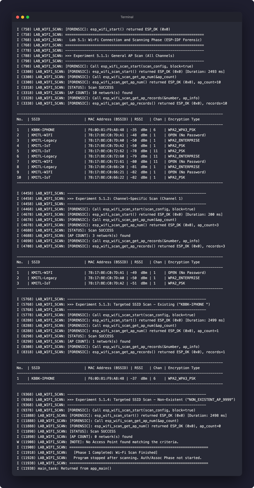

# รายงานการทดลอง ใบงานที่ 5.1: Wi-Fi Connection and Scanning

**รหัสนักศึกษา:** 67030011  
**ชื่อโปรเจกต์:** `Labs/Lab5-1-Wi-Fi-Phase1`  
**ไฟล์ซอร์สโค้ด:** `main/main.c`

---

## ขั้นตอนการสั่งรันโปรแกรม (ESP-IDF CLI / VS Code ESP-IDF Extension)

### 1. ตั้งค่า Target และ Build โปรแกรม
```bash
cd Labs/Lab5-1-Wi-Fi-Phase1
idf.py set-target esp32
idf.py build
```

### 2. Flash โค้ดลงบอร์ด ESP32 และเปิด Serial Monitor
```bash
idf.py -p <PORT> flash monitor
```

---

## บันทึกผลการทดลอง (Experiment Results)

### 1. ตารางสรุปเปรียบเทียบการสแกนทั้ง 4 กรณี

| ข้อการทดลอง | เงื่อนไขการสแกน | สถานะ (Success/Error Code) | จำนวน AP ที่พบ (เครือข่าย) | เวลาที่ใช้ในการสแกน (ms) |
| :---: | :--- | :---: | :---: | :---: |
| **5.1.1** | สแกนทั่วไปทุก Channel (1-13) | ESP_OK (0x0) | 10 | 2,493 ms |
| **5.1.2** | กำหนดสแกนเฉพาะ Channel 1 | ESP_OK (0x0) | 3 | 200 ms |
| **5.1.3** | กำหนดสแกน SSID ที่มีจริง ("KBBK-IPHONE") | ESP_OK (0x0) | 1 | 2,499 ms |
| **5.1.4** | กำหนดสแกน SSID ที่ไม่มีจริง ("NON_EXISTENT_AP_9999") | ESP_OK (0x0) | 0 | 2,498 ms |

### 2. ตารางรายละเอียด AP ที่พบจากการสแกนทั่วไป (ข้อ 5.1.1)

| ลำดับ | ชื่อเครือข่าย (SSID) | MAC Address (BSSID) | ความแรงสัญญาณ (RSSI: dBm) | ช่องความถี่ (Channel) | ประเภทการเข้ารหัส (Encryption Type) |
| :---: | :--- | :--- | :---: | :---: | :--- |
| 1 | KBBK-IPHONE | F6:0D:81:F9:A8:48 | -35 dBm | 6 | WPA2_WPA3_PSK |
| 2 | KMITL-WIFI | 78:17:BE:C0:7D:A1 | -48 dBm | 1 | OPEN (No Password) |
| 3 | KMITL-Legacy | 78:17:BE:C0:7D:A0 | -50 dBm | 1 | WPA2_ENTERPRISE |
| 4 | KMITL-IoT | 78:17:BE:C0:7D:A2 | -50 dBm | 1 | WPA2_PSK |
| 5 | KMITL-IoT | 78:17:BE:C0:72:62 | -78 dBm | 11 | WPA2_PSK |
| 6 | KMITL-Legacy | 78:17:BE:C0:72:60 | -79 dBm | 11 | WPA2_ENTERPRISE |
| 7 | KMITL-WIFI | 78:17:BE:C0:72:61 | -80 dBm | 11 | OPEN (No Password) |
| 8 | KMITL-Legacy | 78:17:BE:C0:66:20 | -81 dBm | 1 | WPA2_ENTERPRISE |
| 9 | KMITL-WIFI | 78:17:BE:C0:66:21 | -82 dBm | 1 | OPEN (No Password) |
| 10 | KMITL-IoT | 78:17:BE:C0:66:22 | -82 dBm | 1 | WPA2_PSK |

### 3. ภาพถ่ายผลการรันโปรแกรมบน Serial Console



---

## ตอบคำถามท้ายการทดลอง (Post-Lab Questions)

### ข้อ 1:
การกำหนดค่าในโครงสร้าง `wifi_scan_config_t` สำหรับสแกนเจาะจงเฉพาะช่องความถี่ (ข้อ 5.1.2) ช่วยลดเวลาในการสแกนเมื่อเทียบกับการสแกนทุกช่องความถี่ (ข้อ 5.1.1) อย่างไร และมีข้อจำกัดอย่างไร?

**คำตอบ:**  
การกำหนดช่องความถี่เจาะจง (เช่น `.channel = 1`) ช่วยให้ Wi-Fi Driver ส่ง Probe Request และรับฟัง Beacon/Probe Response เฉพาะบนช่องสัญญาณวิทยุที่กำหนดเพียงช่องเดียว ทำให้เวลาสแกนลดลงอย่างมากจากประมาณ 2,493 ms เหลือเพียง 200 ms  
**ข้อจำกัด:** หาก Access Point เป้าหมายทำงานอยู่บนช่องความถี่อื่นที่ไม่ใช่ Channel 1 ระบบจะไม่พบ AP ดังกล่าว ทำให้พลาดการเชื่อมต่อ

---

### ข้อ 2:
เมื่อสังเกตผล Forensic Log ในข้อ 5.1.4 (สแกนหา SSID ที่ไม่มีอยู่จริง) ฟังก์ชัน `esp_wifi_scan_start()`, `esp_wifi_scan_get_ap_num()` และ `esp_wifi_scan_get_ap_records()` ส่งคืนค่าอย่างไร?

**คำตอบ:**  
- `esp_wifi_scan_start()` ส่งคืนค่า `ESP_OK (0x0)` (ใช้เวลาสแกน 2,498 ms) เนื่องจากกระบวนการสแกนระดับฮาร์ดแวร์ทำงานสำเร็จเรียบร้อย ไม่ได้เกิด Error ของระบบ  
- `esp_wifi_scan_get_ap_num()` ส่งคืนค่า `ESP_OK (0x0)` และคืนค่า `ap_count = 0` ในตัวแปรนับจำนวน AP  
- `esp_wifi_scan_get_ap_records()` ไม่จำเป็นต้องดึงข้อมูลเนื่องจาก `ap_count = 0` และระบบแจ้งเตือนว่าไม่พบ AP ที่ตรงกับเงื่อนไข

---

### ข้อ 3:
ค่าระดับความแรงสัญญาณ (RSSI) ที่แสดงเป็นตัวเลขติดลบ (เช่น -45 dBm กับ -80 dBm) ค่าใดแสดงถึงสัญญาณที่มีความแรงและความเสถียรมากกว่ากัน?

**คำตอบ:**  
ค่า **-45 dBm** แสดงถึงสัญญาณที่มีความแรงและความเสถียรมากกว่า เนื่องจาก RSSI มีหน่วยเป็น dBm ซึ่งเป็นค่าติดลบ ตัวเลขที่เข้าใกล้ 0 มากกว่า (ค่าน้อยกว่าในทางลบ) หมายถึงกำลังส่งสัญญาณที่ ESP32 รับได้สูงกว่า ลดโอกาสเกิด Packet Loss ได้ดีกว่าค่า -80 dBm ซึ่งเป็นสัญญาณที่อ่อนมาก

---

### ข้อ 4:
เหตุใดการดึงค่า `authmode` (`wifi_auth_mode_t`) จากโครงสร้าง `wifi_ap_record_t` จึงมีความสำคัญต่อการเตรียมการในเฟสถัดไป (Authentication & Association Phase)?

**คำตอบ:**  
ค่า `authmode` ระบุประเภทการรักษาความปลอดภัยของ AP เป้าหมาย (เช่น `OPEN`, `WPA2_PSK`, `WPA3_PSK`, `WPA2_ENTERPRISE`) ซึ่งมีความสำคัญต่อ ESP32 ในการเตรียมโครงสร้างข้อมูล `wifi_config_t` และโปรโตคอลการยืนยันตัวตนในเฟสถัดไป เช่น หากเป็น `OPEN` จะไม่ต้องระบุรหัสผ่าน หากเป็น `WPA2_PSK` จะต้องกำหนดรหัสผ่าน (Password/Pre-Shared Key) และเตรียมกระบวนการทำ 4-Way Handshake ก่อนเข้าสู่ขั้นตอนรับ IP Address ต่อไป
