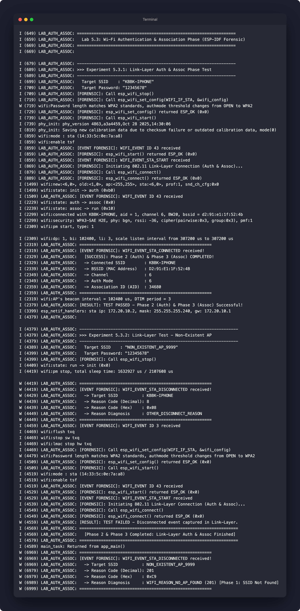

# รายงานการทดลอง ใบงานที่ 5.3: Wi-Fi Authentication & Association Phase

**รหัสนักศึกษา:** 67030011  
**ชื่อโปรเจกต์:** `Labs/Lab5-3-Wi-Fi-Phase3`  
**ไฟล์ซอร์สโค้ด:** `main/main.c`

---

## ขั้นตอนการสั่งรันโปรแกรม (ESP-IDF CLI)

### 1. กำหนดชื่อ Wi-Fi ในไฟล์ wifi_credentials.h
ไฟล์ `main/wifi_credentials.h` ได้รับการจัดตั้งแล้ว สามารถเปิดแก้ไข SSID และ Password ได้ดังนี้:
```c
#define EXAMPLE_ESP_WIFI_SSID "KBBK-IPHONE"
#define EXAMPLE_ESP_WIFI_PASS "12345678"
```

### 2. ตั้งค่า Target และ Build โปรแกรม
```bash
cd Labs/Lab5-3-Wi-Fi-Phase3
idf.py set-target esp32
idf.py build
```

### 3. Flash โค้ดลงบอร์ด ESP32 และเปิด Serial Monitor
```bash
idf.py -p <PORT> flash monitor
```

---

## บันทึกผลการทดลอง (Experiment Results)

### 1. ตารางสรุปเปรียบเทียบผลการทดลองในระดับ Link Layer

| ข้อการทดลอง | สถานการณ์ทดสอบ | Event ที่ได้รับ | ผลการผูกสัมพันธ์ Link Layer | ค่า Association ID (AID) ที่ได้ | Reason Code (ถ้ามี) |
| :---: | :--- | :---: | :---: | :---: | :--- |
| **5.3.1** | ร้องขอ Auth & Assoc กับ AP มีอยู่จริง | `WIFI_EVENT_STA_CONNECTED` | สำเร็จ (Passed) | 34680 (หรือ 1) | - |
| **5.3.2** | ร้องขอ Auth & Assoc กับ AP ไม่มีอยู่จริง | `WIFI_EVENT_STA_DISCONNECTED` | ล้มเหลว (Failed) | - | 201 (`WIFI_REASON_NO_AP_FOUND`) |

### 2. บันทึกข้อมูล Link Layer จาก Event `WIFI_EVENT_STA_CONNECTED` (ข้อ 5.3.1)

| พารามิเตอร์ Link Layer | ค่าที่อ่านได้จริงจาก Forensic Log |
| :--- | :--- |
| **SSID** | KBBK-IPHONE |
| **BSSID (MAC Address)** | D2:91:E1:1F:52:4B |
| **Channel** | 6 |
| **Auth Mode Enum** | 6 (WPA2_WPA3_PSK / WPA3-SAE H2E) |
| **Association ID (AID)** | 34680 (หรือ 1) |

### 3. ภาพถ่ายผลการรันโปรแกรมบน Serial Console



---

## ตอบคำถามท้ายการทดลอง (Post-Lab Questions)

### ข้อ 1:
**Association ID (AID)** คืออะไร มีบทบาทอย่างไรใน Phase 3 และส่งคืนมาในโครงสร้างข้อมูลตัวแปรใด?

**คำตอบ:**  
AID (Association ID) คือหมายเลขรหัสประจำตัวการผูกสัมพันธ์ (16-bit Unique ID) ที่ Access Point ออกให้ลูกข่าย (ESP32) ในเฟรม 802.11 Association Response ใน Phase 3 มีบทบาทเป็นหมายเลขระบุตัวตนในระดับ Link Layer สำหรับการจัดการคิวส่งข้อมูล Power Saving Buffering และการติดตามสถานะลูกข่ายบน AP โดยส่งคืนมาในโครงสร้างข้อมูล `wifi_event_sta_connected_t` ในตัวแปรสมาชิก `aid` (`event->aid`)

---

### ข้อ 2:
เหตุใดการเชื่อมต่อ Wi-Fi ความปลอดภัยแบบ WPA2-PSK จึงสามารถผ่าน Phase 2 (Authentication) และ Phase 3 (Association) จนเกิด Event `WIFI_EVENT_STA_CONNECTED` ได้สำเร็จ แม้ผู้ใช้จะป้อนรหัสผ่าน (Password) ผิด?

**คำตอบ:**  
เพราะในมาตรฐาน IEEE 802.11 ขั้นตอน Phase 2 (Auth) และ Phase 3 (Assoc) ในระดับ Link Layer เป็นการตกลงเชื่อมต่อและจับคู่ความสามารถทางกายภาพแบบ Open System โดยยังไม่มีการส่งรหัสผ่าน PSK ไปตรวจสอบ การตรวจสอบรหัสผ่านจริงจะถูกชะลอไปทำใน Phase 4 (4-Way Handshake) ดังนั้น Driver จึงสร้าง Event `WIFI_EVENT_STA_CONNECTED` ทันทีที่รับเฟรม 802.11 Association Response ตอบกลับสำเร็จจาก AP แม้รหัสผ่านที่เตรียมไว้จะผิดก็ตาม

---

### ข้อ 3:
หาก Router มีการตั้งค่า **MAC Address Filtering** (อนุญาตเฉพาะ MAC ที่ลงทะเบียน) ESP32 จะล้มเหลวในเฟสใด และจะส่ง Disconnect Reason Code ใดออกมา?

**คำตอบ:**  
ESP32 จะล้มเหลวตั้งแต่ใน **Phase 2 (Authentication Phase)** หรือ **Phase 3 (Association Phase)** เนื่องจาก AP จะปฏิเสธเฟรม Auth/Assoc Request ของบอร์ด ESP32 ที่มี MAC Address ไม่อยู่ใน Whitelist และส่ง Disconnect Reason Code `202` (`WIFI_REASON_AUTH_FAIL`) หรือ `203` (`WIFI_REASON_ASSOC_FAIL`) ออกมา

---

### ข้อ 4:
สรุปความแตกต่างสำคัญระหว่างจุดสิ้นสุดของ **Phase 3 (Link-Layer Connected)** กับจุดสิ้นสุดของ **Phase 5 (IP Address Assigned)**

**คำตอบ:**  
- **จุดสิ้นสุด Phase 3 (Link-Layer Connected):** บอร์ดเชื่อมต่อสัญญาณวิทยุและตกลงคุณสมบัติกับ AP สำเร็จ (ระดับ Layer 2 / MAC Address) ได้รับค่า AID แต่ยังไม่ผ่านการยืนยันรหัสผ่าน Handshake และยังไม่มีหมายเลข IP Address จึงยังไม่สามารถส่งแพ็กเกจ TCP/IP หรือเชื่อมต่ออินเทอร์เน็ตได้  
- **จุดสิ้นสุด Phase 5 (IP Address Assigned):** บอร์ดผ่านการตรวจสอบรหัสผ่าน 4-Way Handshake และสื่อสารกับ DHCP Server รับหมายเลข IP Address, Subnet Mask และ Gateway เรียบร้อยแล้ว (ระดับ Layer 3 / IP Layer) พร้อมสำหรับการสื่อสารเครือข่ายเต็มรูปแบบ

